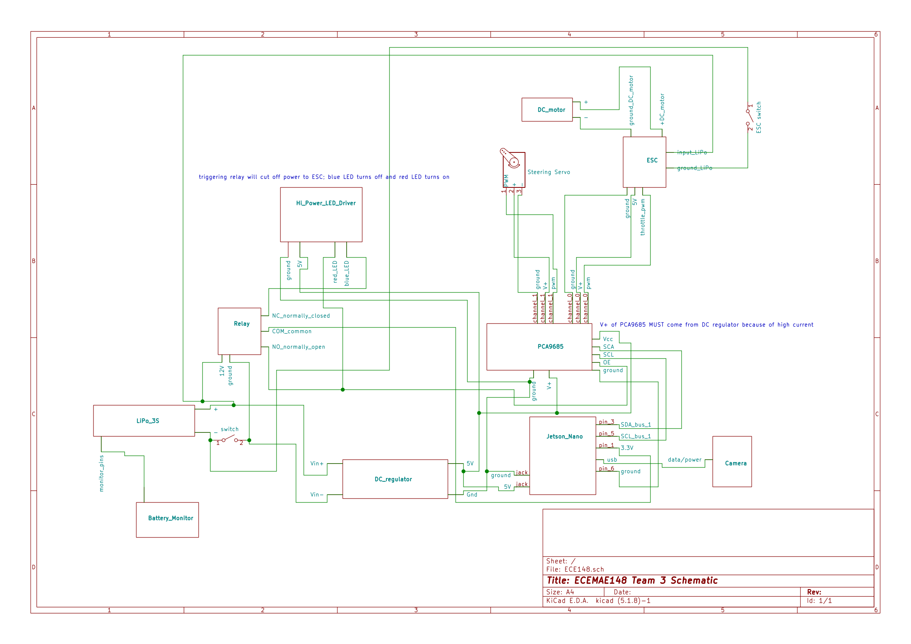
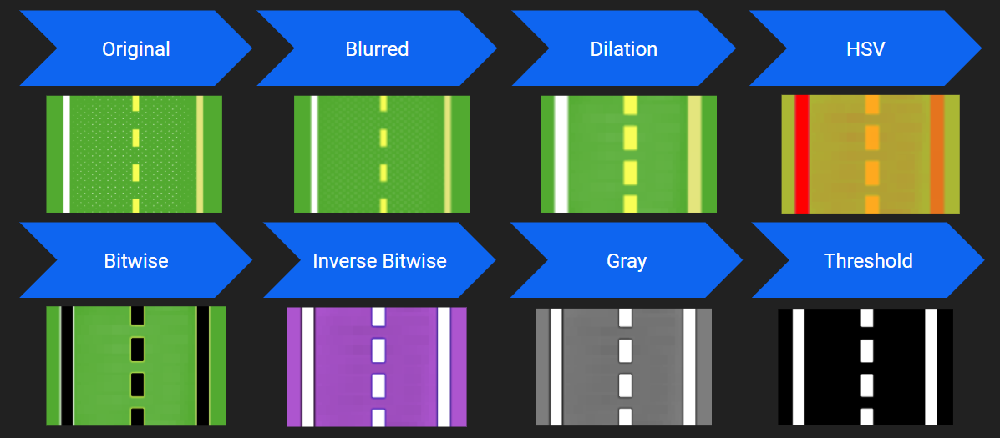
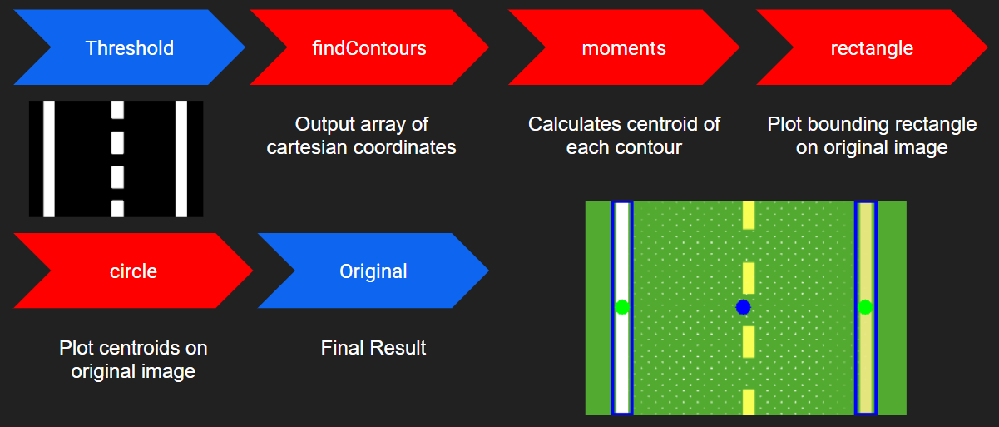
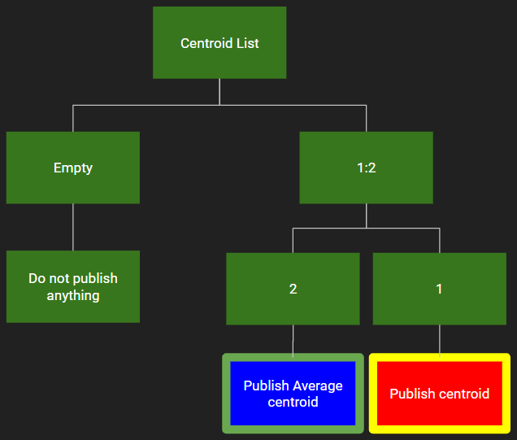

# potatoInside

A ROS package using OpenCV on an RC car to do autonomous laps around a track using line following algorithms.

  
  

## Table of Contents

- [potatoInside](#potatoinside)
  - [Table of Contents](#table-of-contents)
  - [Wiring Schematic](#wiring-schematic)
  - [Dependencies](#dependencies)
    - [cv2](#cv2)
    - [adafruit_servokit](#adafruit_servokit)
    - [cv_bridge](#cv_bridge)
    - [simple-pid](#simple-pid)
  - [Environment Configuration](#environment-configuration)
  - [Package Map](#package-map)
  - [Structure](#structure)
    - [Nodes](#nodes)
      - [**throttle_client**](#throttle_client)
      - [**steering_client**](#steering_client)
      - [**camera_server**](#camera_server)
      - [**lane_detection_node**](#lane_detection_node)
      - [**lane_guidance_node**](#lane_guidance_node)
    - [Calibration](#calbration)
  - [Topics](#topics)
  - [Launch](#launch)
  - [Issues and Fixes](#issues-and-fixes)

## Wiring Schematic

## Dependencies

### [cv2](https://opencv.org/)

OpenCV is a library, in our case for Python, that provides high-level functions for computer vision and image processing.

### [adafruit_servokit](https://circuitpython.readthedocs.io/projects/servokit/en/latest/)

Adafruit Servokit is a Python library that provides a high-level interface with low-level PWM controls. In our case, we are using the library to control PWM servos connected to channels of the PCA9685 I2C breakout board.

### [cv_bridge](http://wiki.ros.org/cv_bridge)

CV Bridge provides functions to easily convert (encode/decode) in between ROS image message types to OpenCV-workable Numpy arrays.

### [simple-pid](https://pypi.org/project/simple-pid/)

Simple PID is a Python library that provides a way to turn a PID controller into a simplified Python object.

## Environment Configuration

If you are running a ROS version that defaults to Python3, you can install the dependencies to the host Python3 or some virtual environment such as Conda. However, ROS versions that default to Python2 will require a virtual environment that has Python3 as the Python PATH i.e. if you type "python" into the terminal Python3 should begin. 

Clone this repo to the **src** of your Catkin workspace. Then, go to the workspace directory and do **catkin_make**. This should register the package as part of your ROS environment. You can check by looking for the package name with **rospack**.

## Package Map

## Structure

### Nodes

#### **throttle_client**

Associated file: throttle_client.py

This node subscribes to the [throttle](#Topics) topic. We use subscriber callback function
to validate and normalize throttle value, and then use the [adafruit_servokit](#adafruit_servokit)
module on **channel 0** for sending signals to the hardware.

This node is also responsible for reading and setting the throttle calibration values.

#### **steering_client**

Associated file: steering_client.py

Similar to [throttle_client](#throttle_client), this node subscribes to the [steering](#Topics)
topic and passes the signals to the hardware. The steering servo is on **channel 1**.

The ServoKit class from the adafruit_servokit library proved to be a simple way to control both our steering servo and drive motor, acting as the interface between user specified steering angles and throttle values and the PWM (Pulse Width Modulation) signal required by the steering servo and drive motor ESC. Our team utilized both the servo and continuous_servo methods of the ServoKit class. The implementation of these can be found in the throttle_client.py and steering_client.py scripts, as well as in potato_calibration.py.

The servo method (without any modifications from stock) accepts user inputs in range [0:180] degrees. Zero corresponds to full left and 180 corresponds to full right steering. Within the ServoKit class 0 and 180 correspond to the minimum and maximum pulse widths sent by the PWM board to the servo motor corresponding to a 1ms to 2ms PWM pulse width range, respectively. Servos standardly are at 0 degrees with a 1ms pulse width and 180 degrees with a 2ms pulse width, with the pulses occuring at a frequency of 50Hz. If for some reason the max steering angle is not achieved when one feeds the ServoKit class a value of 180, the maximum pulse with can be increased beyone the stock value given to the class (standard range is 1000 micro-seconds to 2000 micro-seconds). In the documentation there is also a function to edit the max actuation range, allowing the user to change the max steering value from the stock 180 degrees to a different value.

The continuous_servo method allows for control of an ESC driven DC motor, designed for continuous rotation (compare to a standard servo motor which has a finite range of motion). The input range for this method is [-1:1], with -1 corresponding to the maximum reverse PWM output and 1 corresponding to the maximum forward throttle value. The throttle range for our car was very small before making any changes to the PWM pulse widths. Outputs ranging from no throttle to what appeared to be close to 100% throttle were contained in the range [.28:.3].

#### **camera_server**

Associated file: camera_server.py

This node simply reads from the camera with cv2's interface and publishes the image to the
[camera_rgb](#Topics) topic. Before publishing, the image is reformatted from the cv image format
so it can be passed through the ROS topic message structure.

#### **lane_detection_node**

Associated file: lane_detection.py

In this node, we read from [camera_rgb](#Topics) topic and use opencv to identify line
information from the image, and publish the information of the middle point between
all identified lines to the [centroid](#Topics) topic.

  
  
  

#### **lane_guidance_node**

Associated file: lane_guidance.py

This node subscribes to the [centroid](#Topics) topic, calculates the throttle and steering
based on the centroid value, and then publish them to their corresponding topics.

Throttle is based on whether or not a centroid exists - car goes faster when centroid is present and slows down when there is none.

Steering is based on a PID controller implemented by the [simple-pid](#simple-pid) module. Gains can be tweaked in the **lane_guidance.py** script.

## Calibration

Associated file: potato_calibration.py

A calibration script was created to allow the driver to ensure that the software commands that are sent to the hardware are both within the hardware
limitations, as well as accurately mapped to hardware actuation.

This script utilizes the servokit class from the adafruit_servokit library to send steering and throttle commands to the car to be observed by the user. The
script contains of a sequence of prompts, asking the user to input steering and throttle values that correspond to maximums, minimums and straight/neutral
values. At the end of the script the user can choose to save these values to a configuration file that will be read when the steering and throttle nodes are
launched.

*Dicsuss the beginning of the script where the user can decide PWM values for the max and min servo actuation. Also need to test to see if this works with the continuous_servo class.

## Topics

| Name       | Msg Type              | Info                                                       |
| ---------- | --------------------- | ---------------------------------------------------------- |
| throttle   | std_msgs.msg.Float32  | Float value from -1 to 1 for controlling throttle          |
| steering   | std_msgs.msg.Float32  | Float value from -1 to 1 for controlling steering          |
| camera_rgb | sensor_msgs.msg.Image | Image last read from USB camera image                      |
| centroid   | std_msgs.msg.Int32    | Integer for x coordinate of centroid in camera image space |

## Launch

Launching the package is as simple as **roslaunch potatoinside potato.launch**. This should begin all the necessary nodes and get the car moving.

## Issues and Fixes

### **Error with CV_Bridge conversion from Image message to OpenCV image**

Using **bridge_object.imgmsg_to_cv2()** threw errors on our Jetson Nano environment, so we had to resort to our own image decoder function. Function **decodeImage()** can be imported from **decoder.py**. If you don't want to use our function, the problem can be avoided by properly building CV_Bridge with Python3 in the ROS package.

### **Throttle not working**

This issue can vary between cars, but generally the problem lies in the PWM range that is mapped by the Adafruit library. If the "start" PWM is too low, then even a maxed out "1" might not map to the PWM value that will trigger the ESC. First make sure the -1 to 1 range is properly calibrated. During runtime, the scale constant found in **throttle_client.py** can also be tweaked.

### **cv2 thesholding not picking up road lines**

This issue stems from two sources that are not mutually exclusive:

It can be that the lower and upper HSV ranges configured in **lane_detection.py** are not properly recognizing the color of whatever marks you are trying to parse on your road environment. This can be done through trial and error or by using online color pickers.

Most USB cameras have minds of their own. Essentially, it can do its own processing independent from cv2 like constrast, saturation, and more importantly auto exposure. Adapting to the ambient light means certain HSV ranges may not apply when lighting changes, messing up algorithms. To combat this, you would need to configure your USB camera to manual exposure, ensuring that your HSV range is consistent everywhere. To do this, follow <a href="https://www.kurokesu.com/main/2016/01/16/manual-usb-camera-settings-in-linux/">this</a> page for more information on how to access camera variables via Linux terminal.

### **Steering/throttle is too hard or too soft**

You would need to tune the PID control gains of both steering and throttle via **lane_guidance.py**. This can be done by simply playing around with the constants. Caution is needed when altering the throttle values since too high of throttle draw too much current, shutting down all other electronics on the car including the Jetson. To avoid this, do **rostopic pub throttle** and publish incremental values starting from 0 to the throttle topic to guage the "right" range.

### **ROS version is not compatible with Python3**

This can be solved with virtual environments such as Conda. Simply make sure all terminals opened are sourced to that environment. This can be automated by editing **bashrc**. To check, type in "python" in the terminal; some terminal version of Python3 should begin.

