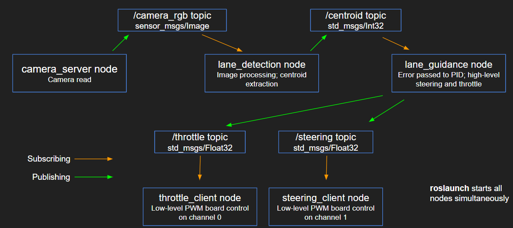

# ucsd_robo_car_simple_ros

A simple ROS package using OpenCV on a 1/10 RC car chassis with ackerman steering that can follow a yellow line using a simple line following algorithm and opencv methods.

## Table of Contents

- [ucsd_robo_car_simple_ros](#ucsd_robo_car_simple_ros)
  - [Table of Contents](#table-of-contents)
  - [Dependencies](#dependencies)
    - [cv2](#cv2)
    - [adafruit_servokit](#adafruit_servokit)
    - [cv_bridge](#cv_bridge)
  - [Environment Configuration](#environment-configuration)
  - [Package Map](#package-map)
  - [Structure](#structure)
    - [Nodes](#nodes)
      - [**throttle_client**](#throttle_client)
      - [**steering_client**](#steering_client)
      - [**camera_server**](#camera_server)
      - [**lane_detection_node**](#lane_detection_node)
      - [**lane_guidance_node**](#lane_guidance_node)
  - [Topics](#topics)
  - [Launch](#launch)
  - [Issues and Fixes](#issues-and-fixes)

## Dependencies

### [cv2](https://opencv.org/)

OpenCV is a library, in our case for Python, that provides high-level functions for computer vision and image processing.

### [adafruit_servokit](https://circuitpython.readthedocs.io/projects/servokit/en/latest/)

Adafruit Servokit is a Python library that provides a high-level interface with low-level PWM controls. In our case, we are using the library to control PWM servos connected to channels of the PCA9685 I2C breakout board.

### [cv_bridge](http://wiki.ros.org/cv_bridge)

CV Bridge provides functions to easily convert (encode/decode) in between ROS image message types to OpenCV-workable Numpy arrays.

## Environment Configuration

Please follow the steps below to properly install this library on your Jetson Nano

AFTER you have installed ROS on your Jetson (instructions can be found here: ) enter the commands below in the command window on your Jetson:

`cd projects/catkin_ws/src`

`git clone git@gitlab.com:djnighti/ucsdrobocarsimpleros.git`

`cd ..`

`catkin_make`

`source devel/setup.bash`

`rospack profile`

Now try this to make sure it was compiled correctly: 

`roscd ucsd_robo_car_simple_ros`

If you are brought to this project directory, you are ready to start!

## Package Map

## Structure

### Nodes

#### **throttle_client**

Associated file: throttle_client.py

This node subscribes to the [throttle](#Topics) topic. We use subscriber callback function
to validate and normalize throttle value, and then use the [adafruit_servokit](#adafruit_servokit)
module on **channel 0** for sending signals to the hardware.

This node is also responsible for reading and setting the throttle calibration values.

#### **steering_client**

Associated file: steering_client.py

Similar to [throttle_client](#throttle_client), this node subscribes to the [steering](#Topics)
topic and passes the signals to the hardware. The steering servo is on **channel 1**.

Plenty of information on how to use the adafruit_servokit libraries can be found <a href="https://learn.adafruit.com/16-channel-pwm-servo-driver/python-circuitpython" >here</a> and <a href="https://github.com/adafruit/Adafruit_CircuitPython_ServoKit" >here</a> 

#### **camera_server**

Associated file: camera_server.py

This node simply reads from the camera with cv2's interface and publishes the image to the
[camera_rgb](#Topics) topic. Before publishing, the image is reformatted from the cv image format
so it can be passed through the ROS topic message structure.

#### **lane_detection_node**

Associated file: lane_detection.py

This node reads from [camera_rgb](#Topics) topic and uses opencv to identify line
information from the image, and publish the information of the middle point of 
the yellow lines to the [centroid](#Topics) topic.

#### **lane_guidance_node**

Associated file: lane_guidance.py

This node subscribes to the [centroid](#Topics) topic, calculates the throttle and steering
based on the centroid value, and then publish them to their corresponding topics.

Throttle is based on whether or not a centroid exists - car goes faster when centroid is present and slows down when there is none.

Steering is based on a P controller implemented by its error function. Gain can be tuned in the **lane_guidance.py** script.

## Topics

| Name       | Msg Type              | Info                                                       |
| ---------- | --------------------- | ---------------------------------------------------------- |
| throttle   | std_msgs.msg.Float32  | Float value from -1 to 1 for controlling throttle          |
| steering   | std_msgs.msg.Float32  | Float value from -1 to 1 for controlling steering          |
| camera_rgb | sensor_msgs.msg.Image | Image last read from USB camera image                      |
| centroid   | std_msgs.msg.Int32    | Integer for x coordinate of centroid in camera image space |

## Launch

Launching the package is as simple as **roslaunch ucsd_robo_car_simple_ros simplecv_launch.launch**. This should begin all the necessary nodes and get the car moving.

## Issues and Fixes

### **Error with CV_Bridge conversion from Image message to OpenCV image**

Using **bridge_object.imgmsg_to_cv2()** threw errors on our Jetson Nano environment, so we had to resort to our own image decoder function. Function **decodeImage()** can be imported from **decoder.py**. If you don't want to use our function, the problem can be avoided by properly building CV_Bridge with Python3 in the ROS package.

An alternative solution can be found <a href="https://medium.com/@beta_b0t/how-to-setup-ros-with-python-3-44a69ca36674" >here</a>

### **Throttle not working**

This issue can vary between cars, but generally the problem lies in the battery supply and the PWM range that is mapped by the Adafruit library. If the "start" PWM is too low, then even a maxed out "1" might not map to the PWM value that will trigger the ESC. First make sure the -1 to 1 range is properly calibrated. During runtime, the scale constant found in **throttle_client.py** can also be tuned. As your battery begins to drain, the PWM range becomes under-saturated which decreases performance of the motor. Tip: Always try driving with fully charged battery or periodically recalibrate pwm values manually as motor performance starts decreasing.

### **ROS version is not compatible with Python3**
Try issuing these commands, more info found 
<a href="https://medium.com/@beta_b0t/how-to-setup-ros-with-python-3-44a69ca36674" >here</a>

`sudo apt-get install python3-pip python3-yaml`

`sudo pip3 install rospkg catkin_pkg`

